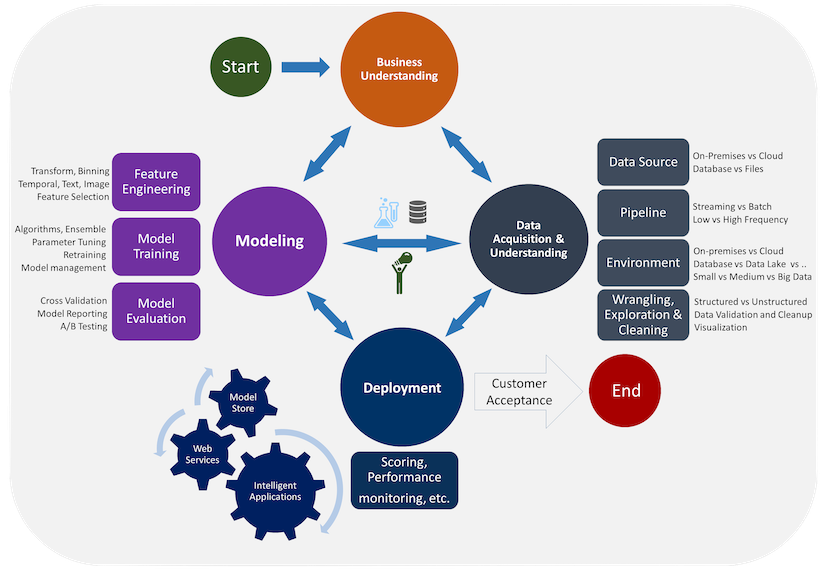

---?image=background-python.jpg

# @color[#ffffff](Web) @color[#ffff00](Scraping)
### @color[#ffffff](with Python)

---?image=speaker.jpg&position=left&size=contain&color=#000000&layout=center-right

@snap[east bio]
<h2>講者介紹</h2>
@ul
- Accelerate 首席培訓導師
- 二十年編程經驗
- 「3forum.hk」創作人
- 「又有得賣喇」創作人
- 多項 ICT 獎項得獎者
- 理工大學會計系學士
@ulend
@snapend

Note: 3min

---

# @fa[plane] 熱身

+++?image=python.png&position=left&size=contain&opacity=15

### Python

@ul
- IEEE 2018 最受歡迎程式語言 @size[12px]([1])
- 跨平台, 非常容易上手
- 常用於 Data Science, Machine Learning, Web Application
@ulend

@snap[south-west]
@size[12px]([1] https://spectrum.ieee.org/static/interactive-the-top-programming-languages-2018)
@snapend

Note: 3min

+++

### HTTP

@ul
- 瀏覽器所看見的任何物件 (`文字，圖像，資訊`) 均經由 HTTP 傳送
- 必須由客戶端發出請求 (`request`) ，然後由伺服器回應 (`response`)
@ulend

Note: 3min

+++

### Web Scraping & Data Science

Note: 3min

+++

### Web Scraping & Applications

@ul
- Data source
- Data analytics
- Market research
- 例子: indeed, jobable, etc
@ulend

Note: 2min

---

# @fa[plane] 實戰

--- 

### 作戰策略

@ol
- 鎖定 Scraping 目標
- 選擇 Scraping 方式
- 編寫 Scraping Script
- 反覆測試
- 導入數據庫作進一步處理
@olend

Note: 10min

--- 

### 1. 鎖定 Scraping 目標

@ul
- Website? 😄
- Mobile Application? 😐
- PDF? Image? 😫
@ulend

Note: 3min

---

### 2. 選擇 Scraping 方式

@ul
- AJAX
- Full page load
@ulend

Note: 5min

+++

### 2a. Full page load

- Scrapy, Puppeteer

+++

### 2b. AJAX

---

### 3. 編寫 Scraping Script
### 4. 反覆測試

Demo time

Note: 10min

---

### 5. 導入數據庫作進一步處理

- CSV
- SQL/Database
- Power BI
- NumPy SciPy Matplotlib

Note: 10min

---

# @fa[plane] BONUS

---

### Accelerate

Note: 2min

+++

### Accelerate

Note: 3min

+++

### Accelerate

Note: 2min

---

### 物業成交下載器

@ol
- Like 我地嘅 facebook
- https://www.facebook.com/Accelerate/
- Message 我地: 「Property scraper」
@olend

Note: 10min

---?image=background-python.jpg

### @color[#ffffff](Web) @color[#ffff00](Scraping)
### @color[#ffffff](with Python)
# @color[#ffff00](Thank you)
